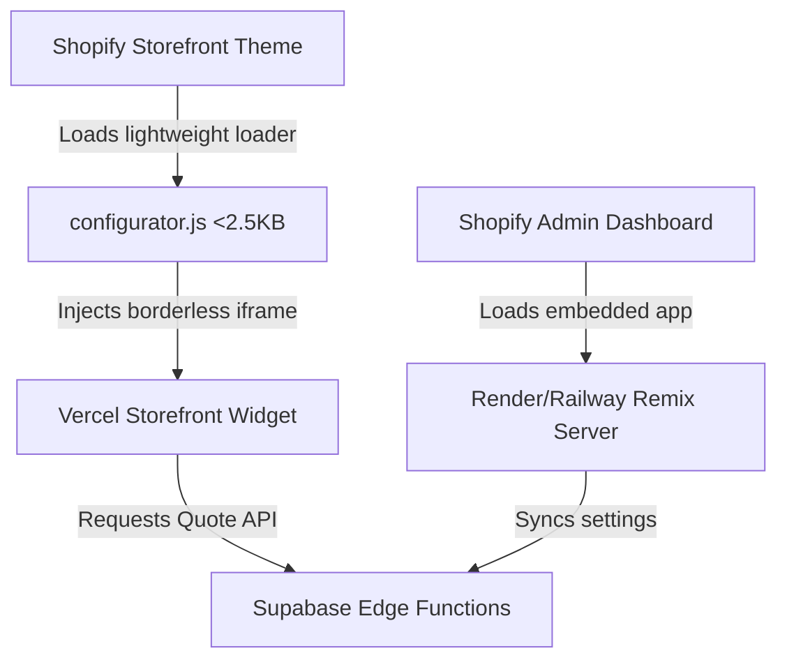

# 🛠️ Decoupled Shopify Backend & Storefront Setup Guide

This guide describes how to deploy and configure the 3D Configurator application using a **decoupled architecture**:
*   **Storefront Widget (Frontend):** Hosted on **Vercel** for high-speed delivery to buyers.
*   **Shopify App Server (Backend):** Hosted on **Render** (paid Starter tier) or **Railway** to handle OAuth, admin dashboard settings, and webhooks 24/7 without hibernation delays.

---

## 1. Decoupled Architecture Overview

| Component | Responsibility | Recommended Host | Why? |
| :--- | :--- | :--- | :--- |
| **Storefront Widget** | Renders 3D viewer, parses STLs, manages buyer inputs. | **Vercel** (Free Tier ok) | Blazing fast static edge hosting. |
| **Shopify Backend** | Embedded admin dashboard, app installation, webhook listeners. | **Render** (Starter) or **Railway** | Runs persistent Node.js Remix server without hibernation. |

---

## 2. Deploying the Shopify Backend

Follow these steps to host your backend server on **Render** (Starter Web Service at $7/mo to avoid sleep) or **Railway**.

### Setup Parameters
When linking your repository to your host provider, configure these repository settings:

*   **Root Directory:** `shopify-app` 
    > [!IMPORTANT]
    > You must set this parameter. The backend server code lives strictly within the `/shopify-app` subdirectory of the repository.
*   **Build Command:** `npm install && npm run build`
*   **Start Command:** `npm run start`
*   **Environment File:** Configuration variables listed below.

---

## 3. Environment Variables (`.env`)

You must add these environment variables to your hosting dashboard's settings.

| Key | Example Value | Description |
| :--- | :--- | :--- |
| **`SHOPIFY_API_KEY`** | `8fab72695fff15...` | Your Shopify Client ID (from Partner Dashboard). |
| **`SHOPIFY_API_SECRET`** | `shpss_9b2ea...` | Your Shopify Client Secret (from Partner Dashboard). |
| **`SCOPES`** | `write_products,write_theme_definitions` | Shopify permissions your app requires. |
| **`SHOPIFY_APP_URL`** | `https://your-backend.onrender.com` | The live URL of your Render or Railway backend service. |
| **`SUPABASE_URL`** | `https://xyz.supabase.co` | Your Supabase project URL. |
| **`SUPABASE_ANON_KEY`** | `eyJhbGciOi...` | Your Supabase public anonymous key. |

---

## 4. Shopify Partner Dashboard Configuration

Once your Render/Railway backend is live and has a public URL (e.g. `https://your-backend.onrender.com`), configure it in your Shopify Partner account.

1.  Log in to the [Shopify Partner Dashboard](https://partners.shopify.com/).
2.  Navigate to **Apps** & select **3D Configurator**.
3.  Click **Configuration** in the sidebar.
4.  Update your URLs:
    *   **App URL:** `https://your-backend.onrender.com`
    *   **Allowed redirection URL(s):** `https://your-backend.onrender.com/auth/callback`
5.  Click **Save**.

---

## 5. Storefront Frontend Setup (Vercel)

Since the frontend is fully decoupled, it can be built and deployed instantly to Vercel.

### Step 1: Deploy to Vercel
1. Link your main workspace repository to **Vercel**.
2. Vercel will automatically detect the Vite project at the root level.
3. Add any necessary environment variables (like `VITE_SUPABASE_URL` and `VITE_SUPABASE_ANON_KEY`) in the Vercel dashboard.
4. Click **Deploy**. Vercel will generate a URL (e.g., `https://polar-3d-configurator.vercel.app`).

### Step 2: Configure the Shopify Theme Extension
Now, link the two components together inside your store's theme editor:

1. In your Shopify Store Admin, customize your active theme.
2. Add the **3D Configurator** app block to the desired product section.
3. In the block's settings sidebar, paste your Vercel URL into the **Widget Hosted URL** input field:
   * **`Widget Hosted URL`:** `https://polar-3d-configurator.vercel.app`
4. Click **Save** in the theme customizer.

> [!TIP]
> The app block uses a ultra-lightweight iframe loader (`configurator.js` under 2.5KB) which completely bypasses Shopify's 10KB block limit, while rendering your rich 3D configurator experience in high fidelity!
